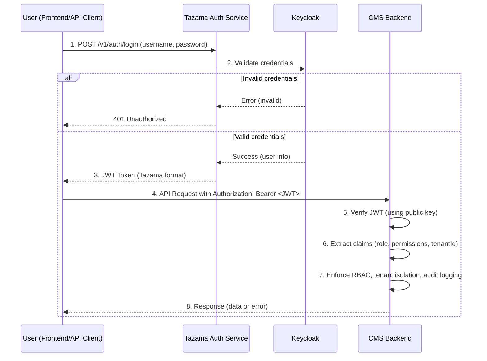

# Tazama Case and Investigation Management System

Tazama Case and Investigation Management System is a comprehensive solution for managing cases and investigations efficiently. This project aims to streamline workflows, improve collaboration, and provide robust tools for tracking, reporting, and analyzing case data.

---
# Tazama Case Management System – Authentication Flow

## Overview

This project uses a secure, centralized authentication flow leveraging Keycloak, the Tazama Auth Service, and JWT-based authorization in the CMS backend.  
Below is a sequence diagram and explanation of how authentication and authorization work in this system.

---

## Authentication Sequence Diagram



## Description

[Nest](https://github.com/nestjs/nest) framework TypeScript starter repository.

## Project setup

```bash
$ npm install
```

## Compile and run the project

```bash
# development
$ npm run start

# watch mode
$ npm run start:dev

# production mode
$ npm run start:prod
```

## Run tests

```bash
# unit tests
$ npm run test

# e2e tests
$ npm run test:e2e

# test coverage
$ npm run test:cov
```

