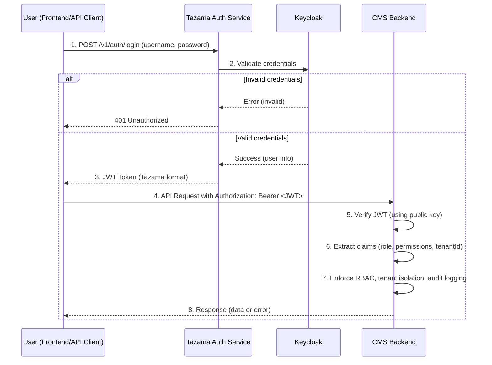

<<<<<<< HEAD
<<<<<<< HEAD
=======
>>>>>>> 875cecd (feat(core): init NestJS with triage mock API)
# Tazama Case and Investigation Management System

Tazama Case and Investigation Management System is a comprehensive solution for managing cases and investigations efficiently. This project aims to streamline workflows, improve collaboration, and provide robust tools for tracking, reporting, and analyzing case data.

---

# Tazama Case Management System – Authentication Flow

## Overview

This project uses a secure, centralized authentication flow leveraging Keycloak, the Tazama Auth Service, and JWT-based authorization in the CMS backend.  
Below is a sequence diagram and explanation of how authentication and authorization work in this system.

---

## Authentication Sequence Diagram



<<<<<<< HEAD
## Table of Contents

- [1. Component Overview](#1-component-overview)
- [2. System Architecture](#2-system-architecture)
  - [2.1 Authentication Flow](#21-authentication-flow)
- [3. Configuration](#3-configuration)
- [5. Running the Service](#5-running-the-service)
- [6. Testing](#6-testing)
- [7. Coding Standards](#7-coding-standards)
- [8. Troubleshooting](#8-troubleshooting)
- [9. Security](#9-security)


---

## **_1. Component Overview_**

This is a NestJS + TypeScript service for managing financial crime cases and investigations. It includes modules for triage, alert-to-case conversion, tasking, evidence, reporting, auditing, and authentication/authorization (Keycloak via Tazama Auth Service). It uses PostgreSQL via Prisma and supports multi-tenant RBAC.

---

## **_2. System Architecture_**

### **2.1 Authentication Flow**

# Tazama Case Management System – Authentication Flow

## Overview

This project uses a secure, centralized authentication flow leveraging Keycloak, the Tazama Auth Service, and JWT-based authorization in the CMS backend.  
Below is a sequence diagram and explanation of how authentication and authorization work in this system.

---

## Authentication Sequence Diagram


## **_3. Configuration_**

Application settings are configured primarily via environment variables. See `.env.template` for required values. Key areas:

- Database: Prisma/PostgreSQL connection
- Auth: Keycloak/Tazama Auth Service JWT verification
- NATS (if used): messaging settings
- Logging and audit configuration

---


---

## **_4. Running the Service_**

### Project setup
=======
<p align="center">
  <a href="http://nestjs.com/" target="blank"></a>
</p>

[circleci-image]: https://img.shields.io/circleci/build/github/nestjs/nest/master?token=abc123def456
[circleci-url]: https://circleci.com/gh/nestjs/nest

  <p align="center">A progressive <a href="http://nodejs.org" target="_blank">Node.js</a> framework for building efficient and scalable server-side applications.</p>
    <p align="center">
<a href="https://www.npmjs.com/~nestjscore" target="_blank"></a>
<a href="https://www.npmjs.com/~nestjscore" target="_blank"></a>
<a href="https://www.npmjs.com/~nestjscore" target="_blank"></a>
<a href="https://circleci.com/gh/nestjs/nest" target="_blank"></a>
<a href="https://discord.gg/G7Qnnhy" target="_blank"></a>
<a href="https://opencollective.com/nest#backer" target="_blank"></a>
<a href="https://opencollective.com/nest#sponsor" target="_blank"></a>
  <a href="https://paypal.me/kamilmysliwiec" target="_blank"></a>
    <a href="https://opencollective.com/nest#sponsor"  target="_blank"></a>
  <a href="https://twitter.com/nestframework" target="_blank"></a>
</p>
  <!--[](https://opencollective.com/nest#backer)
  [](https://opencollective.com/nest#sponsor)-->

## Description

[Nest](https://github.com/nestjs/nest) framework TypeScript starter repository.

## Project setup
>>>>>>> 875cecd (feat(core): init NestJS with triage mock API)

```bash
$ npm install
```

<<<<<<< HEAD
### Compile and run the project
=======
## Compile and run the project
>>>>>>> 875cecd (feat(core): init NestJS with triage mock API)

```bash
# development
$ npm run start

# watch mode
$ npm run start:dev

# production mode
$ npm run start:prod
```

<<<<<<< HEAD
---

## **_5. Testing_**
=======
## Run tests
>>>>>>> 875cecd (feat(core): init NestJS with triage mock API)

```bash
# unit tests
$ npm run test

# e2e tests
$ npm run test:e2e

# test coverage
$ npm run test:cov
```

<<<<<<< HEAD
---


## **_6. Coding Standards_**

This project follows Tazama code standards and conventions. Use the Event Director repository (`frmscoe/event-director`) as the reference for configuration and practices (ESLint, Prettier, Jest, `tsconfig`, `.gitignore`). Keep your changes consistent with those patterns.

Key tools:

- ESLint for linting
- Prettier for formatting
- Jest for testing

### Linting

### Run lint

Checks your code for style and type issues using ESLint:

```bash
npm run lint
```

### Auto-fix lint errors

Automatically fixes fixable lint and formatting issues:

```bash
npm run lint -- --fix
```

### Formatting

### Format code with Prettier (entire workspace)

```bash
npx prettier --write .
```

### Format only TypeScript in `src/` and `test/`

```bash
npx prettier --write "src/**/*.ts" "test/**/*.ts"
```

### Format coverage output (optional)

```bash
npx prettier --write "coverage/**/*.*"
```

### Testing

### Run all testsgit push

Runs unit and integration tests using Jest:

```bash
npm test
```

Or, equivalently:

```bash
npm run test
```

For e2e tests and coverage, you can also use the existing scripts:

```bash
npm run test:e2e
npm run test:cov
```

### Notes

- Fix all lint and formatting errors before committing code.
- If you add new dependencies or scripts, update this README accordingly.
- For environment setup, see `.env.template`.

---

## **_7. Troubleshooting_**

If you see many TypeScript warnings about `any` usage, add proper types. If Prettier or ESLint behave unexpectedly, check your configuration files (e.g., `eslint.config.mjs`, `.prettierrc`).

---

## **_8. Security_**

- Never commit your `.env` file or secrets to version control.
- Always review code for security best practices before deploying.

---


=======
# case-management-system
Tazama Case and Investigation Management System
>>>>>>> 088485b (Initial commit)
=======
## Deployment

When you're ready to deploy your NestJS application to production, there are some key steps you can take to ensure it runs as efficiently as possible. Check out the [deployment documentation](https://docs.nestjs.com/deployment) for more information.

If you are looking for a cloud-based platform to deploy your NestJS application, check out [Mau](https://mau.nestjs.com), our official platform for deploying NestJS applications on AWS. Mau makes deployment straightforward and fast, requiring just a few simple steps:

```bash
$ npm install -g @nestjs/mau
$ mau deploy
```

With Mau, you can deploy your application in just a few clicks, allowing you to focus on building features rather than managing infrastructure.

## Resources

Check out a few resources that may come in handy when working with NestJS:

- Visit the [NestJS Documentation](https://docs.nestjs.com) to learn more about the framework.
- For questions and support, please visit our [Discord channel](https://discord.gg/G7Qnnhy).
- To dive deeper and get more hands-on experience, check out our official video [courses](https://courses.nestjs.com/).
- Deploy your application to AWS with the help of [NestJS Mau](https://mau.nestjs.com) in just a few clicks.
- Visualize your application graph and interact with the NestJS application in real-time using [NestJS Devtools](https://devtools.nestjs.com).
- Need help with your project (part-time to full-time)? Check out our official [enterprise support](https://enterprise.nestjs.com).
- To stay in the loop and get updates, follow us on [X](https://x.com/nestframework) and [LinkedIn](https://linkedin.com/company/nestjs).
- Looking for a job, or have a job to offer? Check out our official [Jobs board](https://jobs.nestjs.com).

## Support

Nest is an MIT-licensed open source project. It can grow thanks to the sponsors and support by the amazing backers. If you'd like to join them, please [read more here](https://docs.nestjs.com/support).

## Stay in touch

- Author - [Kamil Myśliwiec](https://twitter.com/kammysliwiec)
- Website - [https://nestjs.com](https://nestjs.com/)
- Twitter - [@nestframework](https://twitter.com/nestframework)

## License

Nest is [MIT licensed](https://github.com/nestjs/nest/blob/master/LICENSE).
>>>>>>> 875cecd (feat(core): init NestJS with triage mock API)
