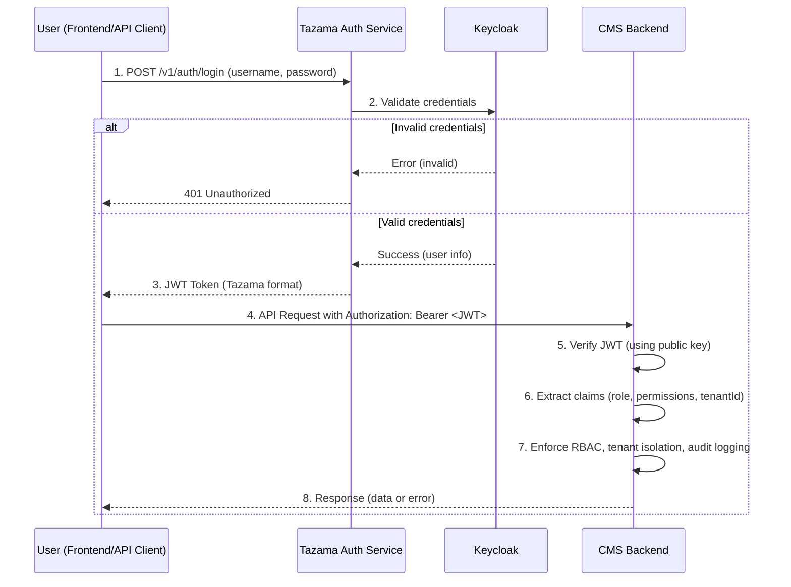

# Tazama Case and Investigation Management System

Tazama Case and Investigation Management System is a comprehensive solution for managing cases and investigations efficiently. This project aims to streamline workflows, improve collaboration, and provide robust tools for tracking, reporting, and analyzing case data.

---

## Table of Contents

- [1. Component Overview](#1-component-overview)
- [2. System Architecture](#2-system-architecture)
  - [2.1 Authentication Flow](#21-authentication-flow)
- [3. Configuration](#3-configuration)
- [5. Running the Service](#5-running-the-service)
- [6. Testing](#6-testing)
- [7. Coding Standards](#7-coding-standards)
- [8. Troubleshooting](#8-troubleshooting)
- [9. Security](#9-security)

---

## **_1. Component Overview_**

This is a NestJS + TypeScript service for managing financial crime cases and investigations. It includes modules for triage, alert-to-case conversion, tasking, evidence, reporting, auditing, and authentication/authorization (Keycloak via Tazama Auth Service). It uses PostgreSQL via Prisma and supports multi-tenant RBAC.

---

## **_2. System Architecture_**

### **2.1 Authentication Flow**

## Table of Contents

- [1. Component Overview](#1-component-overview)
- [2. System Architecture](#2-system-architecture)
  - [2.1 Authentication Flow](#21-authentication-flow)
- [3. Configuration](#3-configuration)
- [4. Data Warehouse (DWH) Setup](#4-data-warehouse-dwh-setup)
- [5. Running the Service](#5-running-the-service)
- [6. Testing](#6-testing)
- [7. Coding Standards](#7-coding-standards)
- [8. Troubleshooting](#8-troubleshooting)
- [9. Security](#9-security)

---

## **_1. Component Overview_**

This is a NestJS + TypeScript service for managing financial crime cases and investigations. It includes modules for triage, alert-to-case conversion, tasking, evidence, reporting, auditing, and authentication/authorization (Keycloak via Tazama Auth Service). It uses PostgreSQL via Prisma and supports multi-tenant RBAC.

---

## **_2. System Architecture_**

### **2.1 Authentication Flow**

# Tazama Case Management System – Authentication Flow

## Overview

This project uses a secure, centralized authentication flow leveraging Keycloak, the Tazama Auth Service, and JWT-based authorization in the CMS backend.  
Below is a sequence diagram and explanation of how authentication and authorization work in this system.

---

## Authentication Sequence Diagram



## **_3. Configuration_**

Application settings are configured primarily via environment variables. See `.env.template` for required values. Key areas:

- Database: Prisma/PostgreSQL connection
- Auth: Keycloak/Tazama Auth Service JWT verification
- NATS (if used): messaging settings
- Logging and audit configuration

---

## **_4. Data Warehouse (DWH) Setup_**

The system includes a separate Data Warehouse database with customer profile data that is linked to alerts via transaction IDs.

### **4.1 DWH Test Data**

The file `prismaDWH/setup-five-customers.sql` contains test data with:
- **10 Customers**: 2 per tenant (CUST-001 & CUST-001B, CUST-002 & CUST-002B, etc.)
- **10 Accounts**: Different FSP accounts per customer (fsp001, fsp001b, fsp002, fsp002b, etc.)
- **15 Transactions**: With distinct sender/receiver relationships

### **4.2 Loading DWH Test Data**

**Windows (PowerShell):**
```powershell
Get-Content prismaDWH\setup-five-customers.sql | npx prisma db execute --schema=prismaDWH/schema.dwh.prisma --stdin
```

**macOS/Linux (Bash):**
```bash
cat prismaDWH/setup-five-customers.sql | npx prisma db execute --schema=prismaDWH/schema.dwh.prisma --stdin
```

**Alternative (All Platforms):**
```bash
npx prisma db execute --file=prismaDWH/setup-five-customers.sql --schema=prismaDWH/schema.dwh.prisma
```

### **4.3 Test Alert Payloads**

The file `test-alerts/alert-payloads.json` contains 10 pre-configured alert payloads:
- **5 NALT Alerts** (IDs 1-5): `report.status = "NALT"` → Creates alert only (no case/task)
- **5 ALRT Alerts** (IDs 6-10): `report.status = "ALRT"` → Creates alert + case + task

**Note**: The CMS reads the `report.status` field from incoming alerts. The upstream Tazama system determines whether an alert is NALT or ALRT based on typology scoring.

**Important:** Alert payloads reference DWH transactions via `OrgnlEndToEndId`:
- Alert 1 → Transaction `TXN-001-01` (fsp001 → fsp001b, John Smith → Alice Cooper)
- Alert 2 → Transaction `TXN-002-01` (fsp002b → fsp002, Tom Harris → Jane Doe)
- Alert 6 → Transaction `TXN-001-02` (fsp001b → fsp001, Alice Cooper → John Smith)
- And so on...

### **4.4 Workflow Integration**

When working with customer profiles in the UI:
1. User receives a task linked to a case
2. Case contains alert with transaction details
3. Transaction `OrgnlEndToEndId` (e.g., `TXN-001-01`) links to DWH
4. Customer profile endpoint: `GET /api/v1/dwh/customer/profile/{transactionId}`
5. Returns sender and receiver customer details with account information

**Example API Call:**
```bash
GET /api/v1/dwh/customer/profile/TXN-001-01
```

**Response includes:**
- **Sender**: John Smith (fsp001, $25,000 balance, personal account)
- **Receiver**: Alice Cooper (fsp001b, $18,000 balance, personal account)
- Transaction amount, date, type, and risk ratings

---

## **_5. Running the Service_**

### Project setup

## **_3. Configuration_**

Application settings are configured primarily via environment variables. See `.env.template` for required values. Key areas:

- Database: Prisma/PostgreSQL connection
- Auth: Keycloak/Tazama Auth Service JWT verification
- NATS (if used): messaging settings
- Logging and audit configuration

## Project setup

---

## **_4. Running the Service_**

### Project setup

## **_3. Configuration_**

Application settings are configured primarily via environment variables. See `.env.template` for required values. Key areas:

- Database: Prisma/PostgreSQL connection
- Auth: Keycloak/Tazama Auth Service JWT verification
- NATS (if used): messaging settings
- Logging and audit configuration

---

---

## **_4. Running the Service_**

### Project setup

```bash
$ npm install
```

### Compile and run the project

```bash
# development


############prisma
# Install Prisma and Client
$ npm install prisma --save-dev
$ npm install @prisma/client

# Initialize Prisma
$ npx prisma init

# After editing schema.prisma → Create migration
$ npx prisma migrate dev --name init

# Push schema to DB without migration history (optional)
$ npx prisma db push

# Generate Prisma Client (run after every schema change)
$ npx prisma generate

$ npm run start

# watch mode
$ npm run start:dev

# production mode
$ npm run start:prod
```

---

## **_5. Testing_**

## Run tests

## **_5. Testing_**

---

## **_5. Testing_**

```bash
# unit tests
$ npm run test

# e2e tests
$ npm run test:e2e

# test coverage
$ npm run test:cov
```

---

## **_6. Coding Standards_**

This project follows Tazama code standards and conventions. Use the Event Director repository (`frmscoe/event-director`) as the reference for configuration and practices (ESLint, Prettier, Jest, `tsconfig`, `.gitignore`). Keep your changes consistent with those patterns.

Key tools:

- ESLint for linting
- Prettier for formatting
- Jest for testing

### Linting

### Run lint

Checks your code for style and type issues using ESLint:

```bash
npm run lint
```

### Auto-fix lint errors

Automatically fixes fixable lint and formatting issues:

```bash
npm run lint -- --fix
```

### Formatting

### Format code with Prettier (entire workspace)

```bash
npx prettier --write .
```

### Format only TypeScript in `src/` and `test/`

```bash
npx prettier --write "src/**/*.ts" "test/**/*.ts"
```

### Format coverage output (optional)

```bash
npx prettier --write "coverage/**/*.*"
```

### Testing

### Run all testsgit push

Runs unit and integration tests using Jest:

```bash
npm test
```

Or, equivalently:

```bash
npm run test
```

For e2e tests and coverage, you can also use the existing scripts:

```bash
npm run test:e2e
npm run test:cov
```

### Notes

- Fix all lint and formatting errors before committing code.
- If you add new dependencies or scripts, update this README accordingly.
- For environment setup, see `.env.template`.

---

## **_7. Troubleshooting_**

If you see many TypeScript warnings about `any` usage, add proper types. If Prettier or ESLint behave unexpectedly, check your configuration files (e.g., `eslint.config.mjs`, `.prettierrc`).

---

## **_8. Security_**

- Never commit your `.env` file or secrets to version control.
- Always review code for security best practices before deploying.

---

# case-management-system

Tazama Case and Investigation Management System

## Deployment

## **_6. Coding Standards_**

This project follows Tazama code standards and conventions. Use the Event Director repository (`frmscoe/event-director`) as the reference for configuration and practices (ESLint, Prettier, Jest, `tsconfig`, `.gitignore`). Keep your changes consistent with those patterns.

Key tools:

- ESLint for linting
- Prettier for formatting
- Jest for testing

### Linting

### Run lint

Checks your code for style and type issues using ESLint:

```bash
npm run lint
```

### Auto-fix lint errors

Automatically fixes fixable lint and formatting issues:

```bash
npm run lint -- --fix
```

### Formatting

### Format code with Prettier (entire workspace)

```bash
npx prettier --write .
```

### Format only TypeScript in `src/` and `test/`

```bash
npx prettier --write "src/**/*.ts" "test/**/*.ts"
```

### Format coverage output (optional)

```bash
npx prettier --write "coverage/**/*.*"
```

### Testing

### Run all testsgit push

Runs unit and integration tests using Jest:

```bash
npm test
```

Or, equivalently:

```bash
npm run test
```

## For e2e tests and coverage, you can also use the existing scripts:

## **_6. Coding Standards_**

This project follows Tazama code standards and conventions. Use the Event Director repository (`frmscoe/event-director`) as the reference for configuration and practices (ESLint, Prettier, Jest, `tsconfig`, `.gitignore`). Keep your changes consistent with those patterns.

Key tools:

- ESLint for linting
- Prettier for formatting
- Jest for testing

### Linting

### Run lint

Checks your code for style and type issues using ESLint:

```bash
npm run lint
```

### Auto-fix lint errors

Automatically fixes fixable lint and formatting issues:

```bash
npm run lint -- --fix
```

### Formatting

### Format code with Prettier (entire workspace)

```bash
npx prettier --write .
```

### Format only TypeScript in `src/` and `test/`

```bash
npx prettier --write "src/**/*.ts" "test/**/*.ts"
```

### Format coverage output (optional)

```bash
npx prettier --write "coverage/**/*.*"
```

### Testing

### Run all testsgit push

Runs unit and integration tests using Jest:

```bash
npm test
```

Or, equivalently:

```bash
npm run test:e2e
npm run test:cov
```

### Notes

- Fix all lint and formatting errors before committing code.
- If you add new dependencies or scripts, update this README accordingly.
- For environment setup, see `.env.template`.

---

## **_7. Troubleshooting_**

If you see many TypeScript warnings about `any` usage, add proper types. If Prettier or ESLint behave unexpectedly, check your configuration files (e.g., `eslint.config.mjs`, `.prettierrc`).

---

## **_8. Security_**

- Never commit your `.env` file or secrets to version control.
- Always review code for security best practices before deploying.

---

Nest is [MIT licensed](https://github.com/nestjs/nest/blob/master/LICENSE).
npm run test

````

For e2e tests and coverage, you can also use the existing scripts:

```bash
npm run test:e2e
npm run test:cov
````

### Notes

- Fix all lint and formatting errors before committing code.
- If you add new dependencies or scripts, update this README accordingly.
- For environment setup, see `.env.template`.

---

## **_7. Troubleshooting_**

If you see many TypeScript warnings about `any` usage, add proper types. If Prettier or ESLint behave unexpectedly, check your configuration files (e.g., `eslint.config.mjs`, `.prettierrc`).

---

## **_8. Security_**

- Never commit your `.env` file or secrets to version control.
- Always review code for security best practices before deploying.

---
